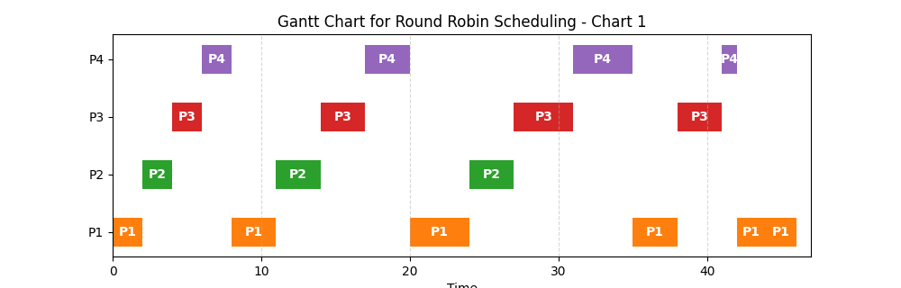
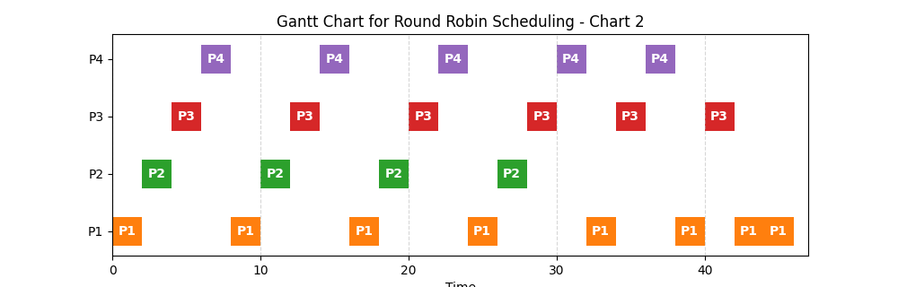
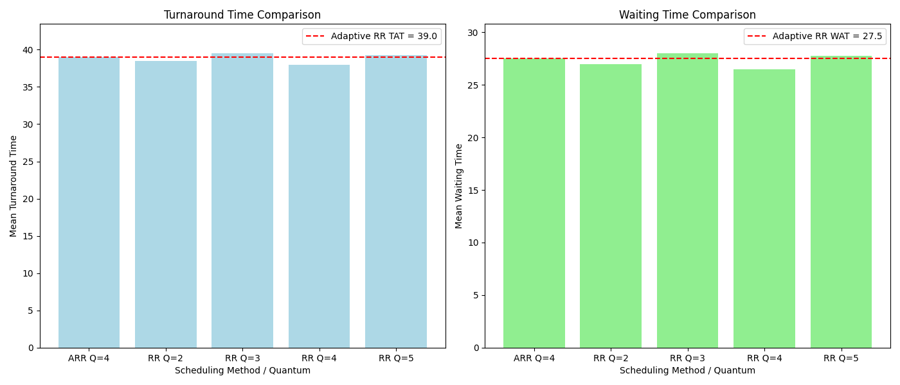

# Process Scheduling Algorithms: Round Robin and Adaptive Round Robin

This project implements two process scheduling algorithms: **Round Robin (RR)** and **Adaptive Round Robin (ARR)**. These algorithms are used for scheduling processes in a system based on their arrival and burst times.

## Table of Contents

- [Introduction](#introduction)
- [Requirements](#requirements)
- [Usage](#usage)
- [Functionality](#functionality)
  - [Process Class](#process-class)
  - [Round Robin](#round-robin)
  - [Adaptive Round Robin](#adaptive-round-robin)
  - [Drawing Gantt Charts](#drawing-gantt-charts)
  - [Comparing Results](#comparing-results)
  - [Displaying Process Information](#displaying-process-information)
- [Output](#output)
  - [Gantt Charts](#gantt-charts)

## Introduction

This project simulates **Round Robin (RR)** and **Adaptive Round Robin (ARR)** scheduling algorithms for process management in a CPU scheduling context. These algorithms help in determining the execution order of processes based on their arrival time and burst time.

- **Round Robin (RR)**: This is a preemptive scheduling algorithm where each process gets executed for a fixed time slice or quantum. After a process’s quantum is exhausted, it is moved back to the ready queue.
  
- **Adaptive Round Robin (ARR)**: This is a modified version of Round Robin where the quantum adjusts dynamically based on the completion of processes in each round. If any process completes during a round, the quantum decreases; if no process completes, the quantum increases.

## Requirements

To run this code, the following Python packages must be installed:

- `matplotlib`
- `tabulate`

You can install the required dependencies with:

```bash
pip install matplotlib tabulate
```

# Usage

1. **Run the code:**
   - A list of processes is generated randomly.
   - The **Adaptive Round Robin (ARR)** scheduling algorithm is executed first, followed by **Round Robin (RR)** with different time quantums.

2. **Gantt Charts:**
   - After the scheduling simulations, Gantt charts representing the execution of processes are drawn and saved in the `gantt_charts/` directory.
   - Each chart visualizes the scheduling of processes over time.

3. **Metrics:**
   - The program calculates the **mean turnaround time** and **mean waiting time** for the processes and compares them across different quantum values for the Round Robin algorithm.

4. **Viewing the Output:**
   - The program will print the scheduling details of each process, including the **completion time**, **waiting time**, and **turnaround time**.
   - The generated Gantt charts will be saved as images in the `gantt_charts/` directory.

# Functionality

## Process Class
This class represents a process in the system with the following attributes:

- `pid`: Process ID.
- `arrival_time`: Time at which the process arrives.
- `burst_time`: Total CPU time required for the process.
- `remaining_time`: Remaining execution time.
- `waiting_time`: Total waiting time for the process.
- `turnaround_time`: Total turnaround time for the process.
- `completion_time`: Time when the process finishes execution.

## Round Robin
```python
def round_robin(processes: list, quantum: int) -> list:
    # Simulates the Round Robin scheduling algorithm
    ...
```
Simulates the Round Robin scheduling algorithm. It executes each process for a fixed time slice (quantum) and moves them back to the queue if they are not completed.


## Adaptive Round Robin
```python
def adaptive_round_robin(processes: list, initial_quantum: int) -> list:
    # Simulates the Adaptive Round Robin scheduling algorithm
    ...
```
Simulates the Adaptive Round Robin scheduling algorithm. It dynamically adjusts the quantum based on process completion in each round.
### Round Definition in ARR

A "round" is defined as a cycle during which the scheduler selects processes from the ready queue to execute. Specifically, at a given time `t=t0`, when the scheduler determines which process to run, all processes that are ready at that time (e.g., processes `p1`, `p2`, `p3`) are considered as part of the current round. Each process will be executed based on the scheduler's algorithm, and once all the processes that were ready at `t=t0`(`p1`, `p2`, `p3`) have been executed, the round completes.

In essence, a round represents one full cycle of execution for all processes that are ready to run at the time of scheduling.


## Drawing Gantt Charts
```python
def draw_gantt_charts(gantt_charts: list) -> None:
    # Draws the Gantt charts and saves them as images
    ...
```
Draws the Gantt charts for all rounds and saves them into the `gantt_charts/` directory.

## Comparing results
```python
def compare_results(quantums: list, TATs: list, WATs: list) -> None:
    # Compares turnaround and waiting times for different quantums
    ...
```
Compares the mean turnaround time (TAT) and mean waiting time (WAT) for different quantum values and visualizes the comparison using bar charts.
 
## Displaying Process Information
```python
def display_info(processes: list) -> None:
    # Displays the process information in a tabular format.
    ...
```
Displays the information of all processes in a table format, including PID, arrival time, burst time, completion time, turnaround time, and waiting time.

# Output
## Gantt Charts
Gantt charts representing the execution of processes will be saved in the gantt_charts/ directory. Each chart is saved as a PNG file with the name gantt_chart_X.png (where X is the chart index).

Example output:
```
gantt_charts/gantt_chart_1.png
gantt_charts/gantt_chart_2.png
...
```
For instance, the Gantt chart stored as `gantt_charts/gantt_chart_1.png`, which corresponds to the Adaptive Round Robin (AAR) algorithm with a quantum of 2, appears as follows:

Similarly, the Gantt chart stored as `gantt_charts/gantt_chart_2.png`, associated with the Round Robin (RR) algorithm and a quantum of 2, is displayed below:

The corresponding terminal output might appear as follows:
```angular2html
adaptive round robin, starting quantum= 2
Round 1
0->2: P1 ran for 2 units of time. remaining: 14.
2->4: P2 ran for 2 units of time. remaining: 6.
4->6: P3 ran for 2 units of time. remaining: 10.
6->8: P4 ran for 2 units of time. remaining: 8.
quantum increases to 3.
.
.
.
Round 6
44->46: P1 ran for 2 units. process completed.
quantum decreases to 2.
```
Additionally, a summary table is generated, showing the process details and calculated metrics:
```angular2html
+-------+----------------+--------------+-------------------+-------------------+----------------+
|   PID |   Arrival Time |   Burst Time |   Completion Time |   Turnaround Time |   Waiting Time |
+=======+================+==============+===================+===================+================+
|     1 |              0 |           16 |                46 |                46 |             30 |
+-------+----------------+--------------+-------------------+-------------------+----------------+
|     2 |              0 |            8 |                27 |                27 |             19 |
+-------+----------------+--------------+-------------------+-------------------+----------------+
|     3 |              0 |           12 |                41 |                41 |             29 |
+-------+----------------+--------------+-------------------+-------------------+----------------+
|     4 |              0 |           10 |                42 |                42 |             32 |
+-------+----------------+--------------+-------------------+-------------------+----------------+
mean turnaround time: 39.0, mean waiting time: 27.5
```
The chart comparing the metrics across different runs is as follows:



